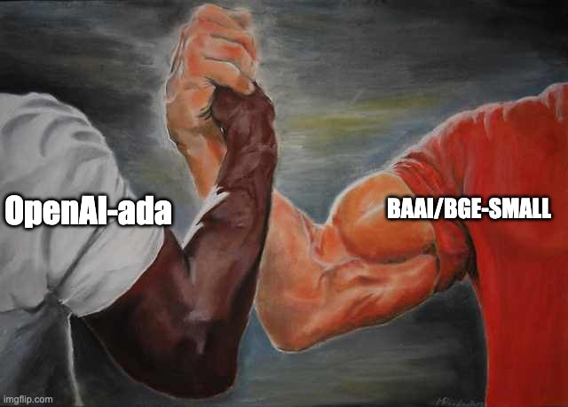

<!-- Adapted for ragas-kotlin on 2026-04-01 -->
> [!NOTE]
> This page was adapted from `../docs/howtos/applications/compare_embeddings.md` for the Kotlin port (`ragas-kotlin`).
> Python APIs/examples may not map 1:1. Use Kotlin entrypoints in package `ragas` and check [`/home/ugai/ragas/kotlin/PARITY_MATRIX.md`](/home/ugai/ragas/kotlin/PARITY_MATRIX.md) and [`/home/ugai/ragas/kotlin/MIGRATION.md`](/home/ugai/ragas/kotlin/MIGRATION.md).

---
search:
  exclude: true
---

# Compare Embeddings for Retriever (Kotlin)

Retriever quality is highly sensitive to embedding choice. This guide shows a Kotlin-first workflow to compare two embedding-backed retrievers with the same evaluation set and report `context_precision` and `context_recall`.

<figure markdown="span">
{width="600"}
<figcaption>Compare Embeddings</figcaption>
</figure>

## 1) Define evaluation cases

Use real questions from your domain and include reference context (or gold answer) per question.

```kotlin
data class EvalCase(
    val question: String,
    val referenceAnswer: String,
    val referenceContexts: List<String>,
)

val evalCases = listOf(
    EvalCase(
        question = "What is retrieval-augmented generation?",
        referenceAnswer = "RAG combines retrieval from external knowledge with generation.",
        referenceContexts = listOf("RAG retrieves relevant context and conditions generation on it.")
    ),
    EvalCase(
        question = "Why compare embedding models?",
        referenceAnswer = "Embedding quality changes retrieval relevance and downstream answer quality.",
        referenceContexts = listOf("Different embedding spaces rank documents differently for the same query.")
    )
)
```

## 2) Build two pipelines that only differ by embeddings

Keep everything else fixed (chunking, top-k, prompting, generation model).

```kotlin
interface Retriever {
    fun retrieve(query: String, topK: Int = 3): List<String>
}

class RagPipeline(private val retriever: Retriever) {
    fun answer(query: String, contexts: List<String>): String {
        // Replace with your actual generation call.
        return "Answer based on: ${contexts.joinToString(" ").take(180)}"
    }

    fun run(query: String): Pair<List<String>, String> {
        val contexts = retriever.retrieve(query)
        val answer = answer(query, contexts)
        return contexts to answer
    }
}

// Example: wire your own retrievers backed by different embedding models.
val openAiRetriever: Retriever = TODO("Retriever using embedding model A")
val bgeRetriever: Retriever = TODO("Retriever using embedding model B")

val openAiRag = RagPipeline(openAiRetriever)
val bgeRag = RagPipeline(bgeRetriever)
```

## 3) Convert runs to `EvaluationDataset`

```kotlin
import ragas.model.EvaluationDataset
import ragas.model.SingleTurnSample

fun buildDataset(cases: List<EvalCase>, rag: RagPipeline): EvaluationDataset<SingleTurnSample> {
    val samples = cases.map { c ->
        val (retrievedContexts, response) = rag.run(c.question)
        SingleTurnSample(
            userInput = c.question,
            response = response,
            retrievedContexts = retrievedContexts,
            referenceContexts = c.referenceContexts,
            reference = c.referenceAnswer,
        )
    }
    return EvaluationDataset(samples)
}

val openAiDataset = buildDataset(evalCases, openAiRag)
val bgeDataset = buildDataset(evalCases, bgeRag)
```

## 4) Evaluate both datasets with the same metrics

```kotlin
import ragas.defaultMetrics
import ragas.evaluate

val metrics = defaultMetrics() // answer_relevancy, context_precision, faithfulness, context_recall

val openAiResult = evaluate(dataset = openAiDataset, metrics = metrics)
val bgeResult = evaluate(dataset = bgeDataset, metrics = metrics)

println("OpenAI context_precision: ${openAiResult.metricMean("context_precision")}")
println("OpenAI context_recall: ${openAiResult.metricMean("context_recall")}")
println("BGE context_precision: ${bgeResult.metricMean("context_precision")}")
println("BGE context_recall: ${bgeResult.metricMean("context_recall")}")
```

## 5) Compare and select

Choose the embedding model that best matches your target behavior:

- Prefer higher `context_precision` when you need cleaner, less noisy retrieval.
- Prefer higher `context_recall` when coverage is more important than strict precision.
- Track both over time; a model swap can improve one and regress the other.

You can also inspect per-sample scores directly:

```kotlin
println(openAiResult.scores)
println(bgeResult.scores)
```

## Notes

- Keep the evaluation set constant while comparing embedding models.
- Use the same retrieval settings (`topK`, chunk size, preprocessing) for both runs.
- If you use framework adapters, convert framework outputs to `SingleTurnSample` and evaluate the same way.
