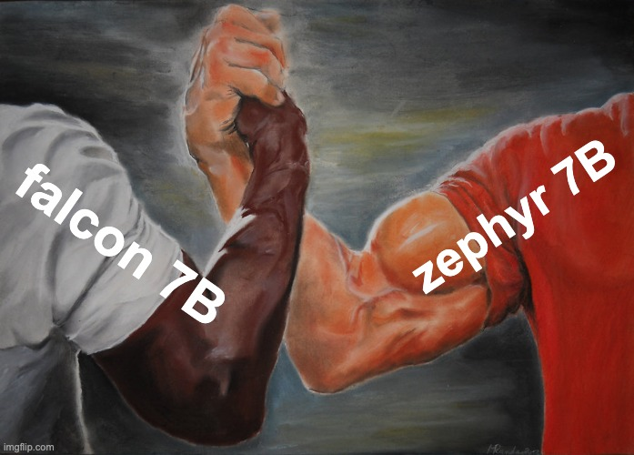

<!-- Adapted for ragas-kotlin on 2026-04-01 -->
> [!NOTE]
> This page was adapted from `../docs/howtos/applications/compare_llms.md` for the Kotlin port (`ragas-kotlin`).
> Python APIs/examples may not map 1:1. Use Kotlin entrypoints in package `ragas` and check [`/home/ugai/ragas/kotlin/PARITY_MATRIX.md`](/home/ugai/ragas/kotlin/PARITY_MATRIX.md) and [`/home/ugai/ragas/kotlin/MIGRATION.md`](/home/ugai/ragas/kotlin/MIGRATION.md).

---
search:
  exclude: true
---

# Compare LLMs for RAG Answers (Kotlin)

The generation model has a direct impact on RAG output quality. This guide compares two LLMs under the same retrieval setup using Ragas metrics in Kotlin.

<figure markdown="span">
{width="800"}
<figcaption>Compare LLMs</figcaption>
</figure>

## 1) Define evaluation cases

Use questions from your domain with expected answers.

```kotlin
data class EvalCase(
    val question: String,
    val referenceAnswer: String,
)

val evalCases = listOf(
    EvalCase(
        question = "What is retrieval-augmented generation?",
        referenceAnswer = "RAG combines retrieval from external knowledge with generation.",
    ),
    EvalCase(
        question = "Why does model choice matter in RAG?",
        referenceAnswer = "Model choice affects factual consistency, relevance, and correctness.",
    ),
)
```

## 2) Keep retrieval fixed and swap only the LLM

```kotlin
interface Retriever {
    fun retrieve(query: String, topK: Int = 3): List<String>
}

interface AnswerGenerator {
    fun generate(query: String, contexts: List<String>): String
}

class RagPipeline(
    private val retriever: Retriever,
    private val generator: AnswerGenerator,
) {
    fun run(query: String): Pair<List<String>, String> {
        val contexts = retriever.retrieve(query)
        val answer = generator.generate(query, contexts)
        return contexts to answer
    }
}

// Replace with your concrete implementations.
val sharedRetriever: Retriever = TODO("Your production retriever")
val llmA: AnswerGenerator = TODO("LLM A adapter")
val llmB: AnswerGenerator = TODO("LLM B adapter")

val pipelineA = RagPipeline(sharedRetriever, llmA)
val pipelineB = RagPipeline(sharedRetriever, llmB)
```

## 3) Build one dataset per LLM run

```kotlin
import ragas.model.EvaluationDataset
import ragas.model.SingleTurnSample

fun buildDataset(cases: List<EvalCase>, pipeline: RagPipeline): EvaluationDataset<SingleTurnSample> {
    val samples = cases.map { c ->
        val (retrievedContexts, response) = pipeline.run(c.question)
        SingleTurnSample(
            userInput = c.question,
            response = response,
            retrievedContexts = retrievedContexts,
            reference = c.referenceAnswer,
        )
    }
    return EvaluationDataset(samples)
}

val datasetA = buildDataset(evalCases, pipelineA)
val datasetB = buildDataset(evalCases, pipelineB)
```

## 4) Evaluate both runs with identical metrics

```kotlin
import ragas.evaluate
import ragas.metrics.collections.AnswerCorrectnessMetric
import ragas.metrics.defaults.AnswerRelevancyMetric
import ragas.metrics.defaults.FaithfulnessMetric

val metrics = listOf(
    FaithfulnessMetric(),
    AnswerRelevancyMetric(),
    AnswerCorrectnessMetric(),
)

val resultA = evaluate(dataset = datasetA, metrics = metrics)
val resultB = evaluate(dataset = datasetB, metrics = metrics)

println("LLM A faithfulness: ${resultA.metricMean("faithfulness")}")
println("LLM A answer_relevancy: ${resultA.metricMean("answer_relevancy")}")
println("LLM A answer_correctness: ${resultA.metricMean("answer_correctness")}")

println("LLM B faithfulness: ${resultB.metricMean("faithfulness")}")
println("LLM B answer_relevancy: ${resultB.metricMean("answer_relevancy")}")
println("LLM B answer_correctness: ${resultB.metricMean("answer_correctness")}")
```

## 5) Compare and choose

Pick the model based on your application priorities:

- `faithfulness`: response consistency with retrieved context.
- `answer_relevancy`: alignment between user question and response.
- `answer_correctness`: response correctness vs reference answer.

Inspect row-level scores when aggregate means are close:

```kotlin
println(resultA.scores)
println(resultB.scores)
```

## Notes

- Keep retrieval, chunking, and prompt format constant while comparing LLMs.
- Use the same evaluation cases for both runs.
- Track regressions over time by storing the same metric means per release.
