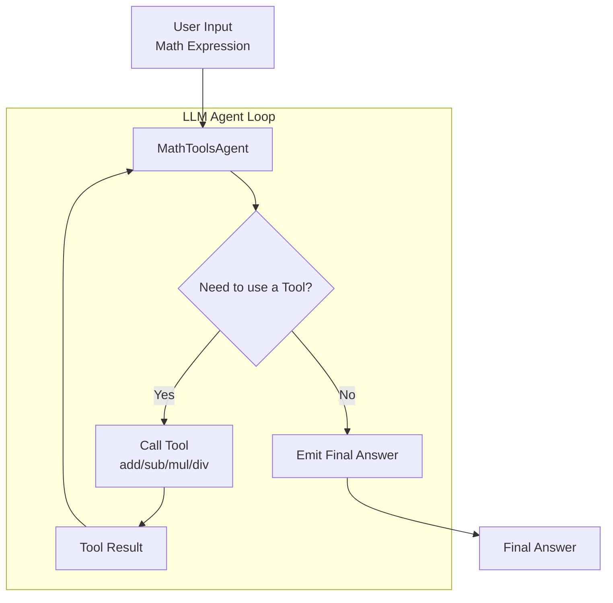

<!-- Adapted for ragas-kotlin on 2026-04-01 -->
> [!NOTE]
> This page was adapted from `../docs/tutorials/agent.md` for the Kotlin port (`ragas-kotlin`).
> Python APIs/examples may not map 1:1. Use Kotlin entrypoints in package `ragas` and check [`/home/ugai/ragas/kotlin/PARITY_MATRIX.md`](/home/ugai/ragas/kotlin/PARITY_MATRIX.md) and [`/home/ugai/ragas/kotlin/MIGRATION.md`](/home/ugai/ragas/kotlin/MIGRATION.md).

# Evaluate an AI agent

> [!NOTE]
> Kotlin tokenizer behavior: `ragas.DEFAULT_TOKENIZER` (JTokkit-backed `TiktokenWrapper`,
> default `o200k_base`) is used for token counting in evaluation/testset flows. Token-based
> metric helpers (`ragas.metrics.tokenize` / `tokenSet`) use `DEFAULT_TOKENIZER` and then
> normalize tokens.

This tutorial demonstrates how to evaluate an AI agent using Ragas, specifically a mathematical agent that can solve complex expressions using atomic operations and function calling capabilities. By the end of this tutorial, you will learn how to evaluate and iterate on an agent using evaluation-driven development.



We will start by testing our simple agent that can solve mathematical expressions using atomic operations and function calling capabilities.

```bash
./gradlew execute -PmainClass=ragas.examples.agent.AgentAppKt
```

Next, we will create a few sample expressions and expected outputs for our agent, then convert them to a CSV file.

```kotlin
import ragas.backends.LocalCsvBackend

data class AgentRow(
    val expression: String,
    val expected: Double,
)

val dataset =
    listOf(
        AgentRow("(2 + 3) * (4 - 1)", 15.0),
        AgentRow("5 * (6 + 2)", 40.0),
        AgentRow("10 - (3 + 2)", 5.0),
    )

LocalCsvBackend("datasets").saveDataset(
    name = "test_dataset",
    data = dataset.map { row -> mapOf("expression" to row.expression, "expected" to row.expected) },
)
```

To evaluate the performance of our agent, we will define a non-LLM metric that compares if our agent's output is within a certain tolerance of the expected output and returns 1/0 based on the comparison.

```kotlin
import ragas.metrics.primitives.NumericMetric

val correctnessMetric =
    NumericMetric(
        name = "correctness",
        prompt =
            """
            Compare predicted result with expected result.
            Return 1.0 when |prediction - expected| < 1e-5, else return 0.0.
            Prediction: {response}
            Expected: {reference}
            """.trimIndent(),
        llm = llm,
        allowedRange = 0.0..1.0,
    )
```

Next, we will write the experiment loop that will run our agent on the test dataset and evaluate it using the metric, and store the results in a CSV file.

```kotlin
import ragas.backends.LocalCsvBackend
import ragas.experiment
import ragas.model.SingleTurnSample

val runner =
    experiment<AgentRow>(backend = LocalCsvBackend("experiments"), namePrefix = "agent-eval") { row ->
        val prediction = mathAgent.solve(row.expression) // your agent entrypoint
        val score =
            correctnessMetric.singleTurnAscore(
                SingleTurnSample(
                    userInput = row.expression,
                    response = prediction.result.toString(),
                    reference = row.expected.toString(),
                ),
            )

        mapOf(
            "expression" to row.expression,
            "expected_result" to row.expected,
            "prediction" to prediction.result,
            "log_file" to prediction.logFile,
            "correctness" to score,
        )
    }
```

Now whenever you make a change to your agent, you can run the experiment and see how it affects the performance of your agent.

## Running the example end to end

1. Set up your OpenAI API key
```bash
export OPENAI_API_KEY="your_api_key_here"
```

2. Run the evaluation
```bash
./gradlew execute -PmainClass=ragas.examples.agent.EvalsKt
``` 

Voilà! You have successfully evaluated an AI agent using Ragas. You can now view the results by opening the `experiments/experiment_name.csv` file.
