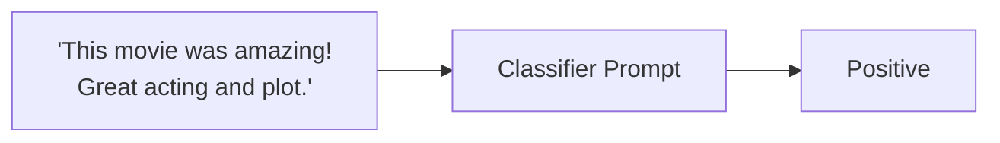

<!-- Adapted for ragas-kotlin on 2026-04-01 -->
> [!NOTE]
> This page was adapted from `../docs/tutorials/prompt.md` for the Kotlin port (`ragas-kotlin`).
> Python APIs/examples may not map 1:1. Use Kotlin entrypoints in package `ragas` and check [`/home/ugai/ragas/kotlin/PARITY_MATRIX.md`](/home/ugai/ragas/kotlin/PARITY_MATRIX.md) and [`/home/ugai/ragas/kotlin/MIGRATION.md`](/home/ugai/ragas/kotlin/MIGRATION.md).

# Prompt Evaluation

> [!NOTE]
> Kotlin tokenizer behavior: `ragas.DEFAULT_TOKENIZER` (JTokkit-backed `TiktokenWrapper`,
> default `o200k_base`) is used for token counting in evaluation/testset flows. Token-based
> metric helpers (`ragas.metrics.tokenize` / `tokenSet`) use `DEFAULT_TOKENIZER` and then
> normalize tokens.

In this tutorial, we will write a simple evaluation pipeline to evaluate a prompt that is part of an AI system, here a movie review sentiment classifier. At the end of this tutorial you’ll learn how to evaluate and iterate on a single prompt using evaluation driven development. 




We will start by testing a simple prompt that classifies movie reviews as positive or negative. 

First, make sure you have installed ragas examples and setup your OpenAI API key:

```bash
./gradlew build
export OPENAI_API_KEY="your_openai_api_key"
```

Now test the prompt:

```bash
./gradlew execute -PmainClass=ragas.examples.prompteval.PromptAppKt
```

This will test the input `"The movie was fantastic and I loved every moment of it!"` and should output `"positive"`.

> **💡 Quick Start**: If you want to see the complete evaluation in action, you can jump straight to the [end-to-end command](#running-the-example-end-to-end) that runs everything and generates the CSV results automatically.

Next, we will write down few sample inputs and expected outputs for our prompt. Then convert them to a CSV file. 

```kotlin
import ragas.backends.LocalCsvBackend

data class PromptRow(
    val text: String,
    val label: String,
)

val dataset =
    listOf(
        PromptRow("I loved the movie! It was fantastic.", "positive"),
        PromptRow("The movie was terrible and boring.", "negative"),
        PromptRow("It was an average film, nothing special.", "positive"),
        PromptRow("Absolutely amazing! Best movie of the year.", "positive"),
    )

LocalCsvBackend("datasets").saveDataset(
    name = "test_dataset",
    data = dataset.map { row -> mapOf("text" to row.text, "label" to row.label) },
)
```

Now we need to have a way to measure the performance of our prompt in this task. We will define a metric that will compare the output of our prompt with the expected output and outputs pass/fail based on it. 

```kotlin
import ragas.metrics.MetricType
import ragas.metrics.primitives.DiscreteMetric

val accuracyMetric =
    DiscreteMetric(
        name = "accuracy",
        prompt =
            """
            Check if the predicted sentiment matches the expected sentiment.
            Prediction: {response}
            Expected: {reference}
            Return "pass" or "fail".
            """.trimIndent(),
        llm = llm,
        allowedValues = listOf("pass", "fail"),
        requiredColumns = mapOf(MetricType.SINGLE_TURN to setOf("response", "reference")),
    )
```

Next, we will write the experiment loop that will run our prompt on the test dataset and evaluate it using the metric, and store the results in a csv file. 

```kotlin
import ragas.backends.LocalCsvBackend
import ragas.experiment
import ragas.model.SingleTurnSample

val runner =
    experiment<PromptRow>(backend = LocalCsvBackend("experiments"), namePrefix = "prompt-eval") { row ->
        val response = runPrompt(row.text) // your application prompt function
        val score =
            accuracyMetric.singleTurnAscore(
                SingleTurnSample(
                    userInput = row.text,
                    response = response,
                    reference = row.label,
                ),
            )
        mapOf(
            "text" to row.text,
            "label" to row.label,
            "response" to response,
            "score" to score,
        )
    }
```

Now whenever you make a change to your prompt, you can run the experiment and see how it affects the performance of your prompt.

### Passing Additional Parameters

You can pass additional parameters like models or configurations to your experiment function:

```kotlin
suspend fun runWithModel(
    dataset: List<PromptRow>,
    modelName: String,
) {
    val runner =
        experiment<PromptRow>(backend = LocalCsvBackend("experiments"), namePrefix = "prompt-eval-$modelName") { row ->
            val response = runPrompt(row.text, modelName = modelName)
            val score =
                accuracyMetric.singleTurnAscore(
                    SingleTurnSample(
                        userInput = row.text,
                        response = response,
                        reference = row.label,
                    ),
                )
            mapOf("text" to row.text, "label" to row.label, "response" to response, "score" to score)
        }

    runner.arun(dataset = dataset, name = "baseline")
}
```


## Running the example end to end

1. Setup your OpenAI API key
```bash
export OPENAI_API_KEY="your_openai_api_key"
```
2. Run the evaluation
```bash
./gradlew execute -PmainClass=ragas.examples.prompteval.EvalsKt
```

This will:

- Create the test dataset with sample movie reviews
- Run the sentiment classification prompt on each sample  
- Evaluate the results using the accuracy metric
- Export everything to a CSV file with the results

Voila! You have successfully run your first evaluation using Ragas. You can now inspect the results by opening the `experiments/experiment_name.csv` file.
