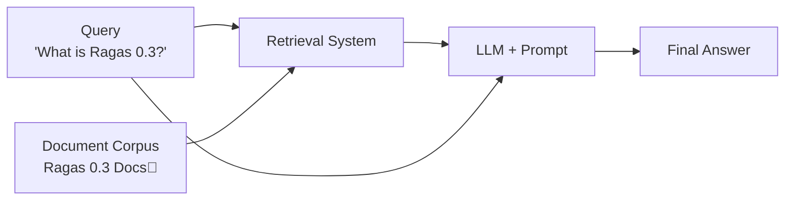

<!-- Adapted for ragas-kotlin on 2026-04-01 -->
> [!NOTE]
> This page was adapted from `../docs/tutorials/rag.md` for the Kotlin port (`ragas-kotlin`).
> Python APIs/examples may not map 1:1. Use Kotlin entrypoints in package `ragas` and check [`/home/ugai/ragas/kotlin/PARITY_MATRIX.md`](/home/ugai/ragas/kotlin/PARITY_MATRIX.md) and [`/home/ugai/ragas/kotlin/MIGRATION.md`](/home/ugai/ragas/kotlin/MIGRATION.md).

# Evaluate a simple RAG system

> [!NOTE]
> Kotlin tokenizer behavior: `ragas.DEFAULT_TOKENIZER` (JTokkit-backed `TiktokenWrapper`,
> default `o200k_base`) is used for token counting in evaluation/testset flows. Token-based
> metric helpers (`ragas.metrics.tokenize` / `tokenSet`) use `DEFAULT_TOKENIZER` and then
> normalize tokens.

In this tutorial, we will write a simple evaluation pipeline to evaluate a RAG (Retrieval-Augmented Generation) system. At the end of this tutorial, you’ll learn how to evaluate and iterate on a RAG system using evaluation-driven development.



We will start by writing a simple RAG system that retrieves relevant documents from a corpus and generates an answer using an LLM.

```bash
./gradlew execute -PmainClass=ragas.examples.rageval.EvalsKt
```


Next, we will write down a few sample queries and expected outputs for our RAG system. Then convert them to a CSV file.

```kotlin
import ragas.backends.LocalCsvBackend

data class RagRow(
    val question: String,
    val gradingNotes: String,
)

val samples =
    listOf(
        RagRow("What is Ragas 0.3?", "- Ragas 0.3 is a library for evaluating LLM applications."),
        RagRow("How to install Ragas?", "- install from source - install from package manager"),
        RagRow("What are the main features of Ragas?", "organized around experiments, datasets, and metrics"),
    )

LocalCsvBackend("datasets").saveDataset(
    name = "test_dataset",
    data = samples.map { row -> mapOf("question" to row.question, "grading_notes" to row.gradingNotes) },
)
```

To evaluate the performance of our RAG system, we will define a llm based metric that compares the output of our RAG system with the grading notes and outputs pass/fail based on it.

```kotlin
import ragas.metrics.MetricType
import ragas.metrics.primitives.DiscreteMetric

val correctnessMetric =
    DiscreteMetric(
        name = "correctness",
        prompt =
            """
            Check if the response covers the grading notes and return "pass" or "fail".
            Response: {response}
            Grading Notes: {reference}
            """.trimIndent(),
        llm = llm,
        allowedValues = listOf("pass", "fail"),
        requiredColumns = mapOf(MetricType.SINGLE_TURN to setOf("response", "reference")),
    )
```

Next, we will write the experiment loop that will run our RAG system on the test dataset and evaluate it using the metric, and store the results in a CSV file.

```kotlin
import ragas.backends.LocalCsvBackend
import ragas.experiment
import ragas.model.SingleTurnSample

val runner =
    experiment<RagRow>(backend = LocalCsvBackend("evals"), namePrefix = "rag-eval") { row ->
        val response = ragClient.query(row.question)
        val score =
            correctnessMetric.singleTurnAscore(
                SingleTurnSample(
                    userInput = row.question,
                    response = response.answer,
                    reference = row.gradingNotes,
                ),
            )
        mapOf(
            "question" to row.question,
            "grading_notes" to row.gradingNotes,
            "response" to response.answer,
            "score" to score,
            "log_file" to response.logs,
        )
    }
```

Now whenever you make a change to your RAG pipeline, you can run the experiment and see how it affects the performance of your RAG. 

## Running the example end to end

1. Setup your OpenAI API key
```bash
export OPENAI_API_KEY="your_openai_api_key"
```
2. Run the evaluation
```bash
./gradlew execute -PmainClass=ragas.examples.rageval.EvalsKt
```

Voila! You have successfully run your first evaluation using Ragas. You can now inspect the results by opening the `experiments/experiment_name.csv` file.
