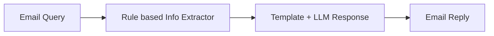

<!-- Adapted for ragas-kotlin on 2026-04-01 -->
> [!NOTE]
> This page was adapted from `../docs/tutorials/workflow.md` for the Kotlin port (`ragas-kotlin`).
> Python APIs/examples may not map 1:1. Use Kotlin entrypoints in package `ragas` and check [`/home/ugai/ragas/kotlin/PARITY_MATRIX.md`](/home/ugai/ragas/kotlin/PARITY_MATRIX.md) and [`/home/ugai/ragas/kotlin/MIGRATION.md`](/home/ugai/ragas/kotlin/MIGRATION.md).

# Evaluate an AI workflow

> [!NOTE]
> Kotlin tokenizer behavior: `ragas.DEFAULT_TOKENIZER` (JTokkit-backed `TiktokenWrapper`,
> default `o200k_base`) is used for token counting in evaluation/testset flows. Token-based
> metric helpers (`ragas.metrics.tokenize` / `tokenSet`) use `DEFAULT_TOKENIZER` and then
> normalize tokens.

This tutorial demonstrates how to evaluate an AI workflow using Ragas, here a simple custom email support triage workflow. By the end of this tutorial, you will learn how to evaluate and iterate on a workflow using evaluation-driven development.



We will start by testing our simple workflow that extracts the necessary information from an email, routes it to the correct template and generates response using an LLM.

```bash
./gradlew execute -PmainClass=ragas.examples.workflow.WorkflowAppKt
```


Next, we will write down a few sample email queries and expected outputs for our workflow. Then convert them to a CSV file.

```kotlin
import ragas.backends.LocalCsvBackend

data class WorkflowRow(
    val email: String,
    val passCriteria: String,
)

val dataset =
    listOf(
        WorkflowRow(
            email = "Hi, I'm getting error code XYZ-123 when using version 2.1.4 of your software. Please help!",
            passCriteria = "category Bug Report; product_version 2.1.4; error_code XYZ-123; response references both version and error code",
        ),
        WorkflowRow(
            email = "I need to dispute invoice #INV-2024-001 for 299.99 dollars. The charge seems incorrect.",
            passCriteria = "category Billing; invoice_number INV-2024-001; amount 299.99; response references invoice and dispute process",
        ),
    )

LocalCsvBackend("datasets").saveDataset(
    name = "test_dataset",
    data = dataset.map { row -> mapOf("email" to row.email, "pass_criteria" to row.passCriteria) },
)
```

To evaluate the performance of our workflow, we will define a llm based metric that compares the output of our workflow with the pass criteria and outputs pass/fail based on it.

```kotlin
import ragas.metrics.MetricType
import ragas.metrics.primitives.DiscreteMetric

val responseQualityMetric =
    DiscreteMetric(
        name = "response_quality",
        prompt =
            """
            Evaluate the response against pass criteria and return "pass" or "fail".
            Pass criteria: {reference}
            Response: {response}
            """.trimIndent(),
        llm = llm,
        allowedValues = listOf("pass", "fail"),
        requiredColumns = mapOf(MetricType.SINGLE_TURN to setOf("response", "reference")),
    )
```

Next, we will write the evaluation experiment loop that will run our workflow on the test dataset and evaluate it using the metric, and store the results in a CSV file.

```kotlin
import ragas.backends.LocalCsvBackend
import ragas.experiment
import ragas.model.SingleTurnSample

val runner =
    experiment<WorkflowRow>(backend = LocalCsvBackend("experiments"), namePrefix = "workflow-eval") { row ->
        val response = workflowClient.processEmail(row.email) // your workflow entrypoint
        val score =
            responseQualityMetric.singleTurnAscore(
                SingleTurnSample(
                    userInput = row.email,
                    response = response.responseTemplate,
                    reference = row.passCriteria,
                ),
            )
        mapOf(
            "email" to row.email,
            "pass_criteria" to row.passCriteria,
            "response" to response.responseTemplate,
            "score" to score,
        )
    }
```

Now whenever you make a change to your workflow, you can run the experiment and see how it affects the performance of your workflow. Then compare it to the previous results to see how it has improved or degraded.

## Running the example end to end
1. Setup your OpenAI API key
```bash
export OPENAI_API_KEY="your_openai_api_key"
```

2. Run the experiment
```bash
./gradlew execute -PmainClass=ragas.examples.workflow.EvalsKt
```

Voila! You have successfully run your first evaluation using Ragas. You can now inspect the results by opening the `experiments/experiment_name.csv` file.
